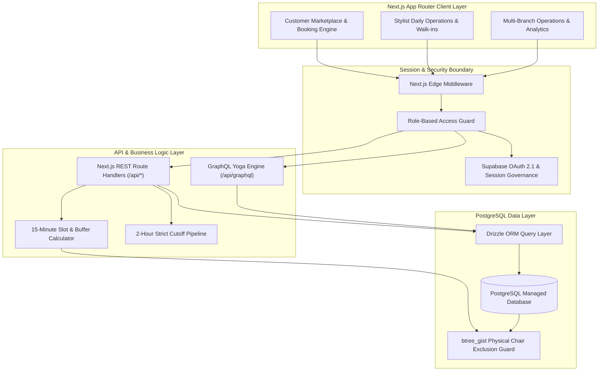

# Aura — Enterprise Salon Appointment Marketplace & Multi-Branch Engine

A high-performance, multi-tenant salon appointment booking and branch management platform engineered with **Next.js 14 (App Router)**, **PostgreSQL (v15+)**, **Drizzle ORM**, and **Tailwind CSS**, pre-configured for direct deployment with **Supabase Backend Services**.

---

## 🌟 Key Capabilities

- **Neighborhood Marketplace Discovery**: Dynamic search across Surat localities (Althan, Adajan, Athwa, Vesu) with live station capacity and curated service menus.
- **Unified Role-Based Authentication**: Seamless single sign-in supporting Customers, Stylists, and Salon Admins with automatic portal routing and Supabase Google OAuth 2.1 integration.
- **Deterministic GiST Slot Lock Engine**: PostgreSQL `btree_gist` exclusion constraints guaranteeing mathematically zero simultaneous double-bookings on physical chair stations.
- **15-Minute Dynamic Slot Engine**: Computes service durations with dedicated station prep buffers and store operating hours.
- **Contactless Digital Appointment Pass**: In-app pass featuring geometric QR codes, arrival directions, and a live 4-step visual delivery tracker (`BOOKED` → `CONFIRMED` → `IN_PROGRESS` → `COMPLETED`).
- **Stylist Operations Roster & Quick Walk-ins**: Daily station roster management, break schedule adjustments, and 1-click on-the-spot walk-in booking desk.
- **Admin Command Center & Multi-Outlet Provisioning**: Cold-start branch outlet creation, cross-branch service catalog cloning, custom staff roles, dynamic station allocation, and live revenue analytics.
- **Automated Customer Self-Service**: In-app rescheduling and cancellation workflows strictly guarded by a 2-hour policy window.

---

## 🏗️ System Architecture



---

## 🛠️ Technology Stack

| Layer | Technologies |
| :--- | :--- |
| **Frontend** | Next.js 14 (App Router, Server & Client Components), React 18, TypeScript |
| **Styling** | Tailwind CSS, Aura Minimalist Luxury Design System, Lucide Icons |
| **Database** | PostgreSQL (v15+) with `btree_gist` exclusion constraints |
| **Backend & ORM** | Drizzle ORM, GraphQL Yoga, Next.js Edge & Route Handlers |
| **Cloud Infrastructure** | [Supabase](https://supabase.com) (Auth, Managed Postgres, Realtime WAL, Storage) |
| **Testing** | Playwright E2E Test Suite (55 canonical journeys), tsx Verification Suites |

---

## 🚀 Getting Started

### 1. Prerequisites
- Node.js 18.17+ or Node.js 20+
- PostgreSQL database instance (Supabase Managed Postgres or Local Docker Postgres)

### 2. Environment Configuration
Copy `.env.example` to create your local environment file:
```bash
cp .env.example .env.local
```
Fill in your database URL and Supabase credentials. For complete step-by-step guidance on setting up your own Supabase project, refer to the [Supabase Setup Guide](docs/SUPABASE_SETUP.md).

### 3. Install Dependencies
```bash
npm install
```

### 4. Database Migrations & Multi-Branch Seed
Execute database migrations and populate the canonical Surat demo dataset (branches, stylists, services, and chairs):
```bash
npm run db:migrate
npm run db:seed
```

### 5. Launch Development Server
```bash
npm run dev
```
Open [http://localhost:3000](http://localhost:3000) in your browser.

---

## 🧪 Testing & Verification

The repository includes a comprehensive 98-test verification suite covering end-to-end user journeys, concurrency locks, and edge cases:

```bash
# Run all 55 Playwright E2E tests
npx playwright test

# Run backend workflow tests
npx tsx tests/test_workflows.ts

# Run concurrency and GiST exclusion edge-case tests
npx tsx tests/test_edge_cases.ts
```

---

## 📚 Technical Documentation Directory

- **[DESIGN.md](DESIGN.md)**: Aura minimalist luxury design system tokens, typography, and component styling.
- **[docs/ARCHITECTURE.md](docs/ARCHITECTURE.md)**: Comprehensive architectural patterns, service topologies, and data flow.
- **[docs/SUPABASE_SETUP.md](docs/SUPABASE_SETUP.md)**: Production setup guide for Supabase Auth, Google OAuth, and Postgres extensions.
- **[docs/DATABASE_SCHEMA.md](docs/DATABASE_SCHEMA.md)**: Relational schema, GiST exclusion constraints, and index strategy.
- **[docs/REQUIREMENTS.md](docs/REQUIREMENTS.md)**: Functional specifications and enterprise user journeys.
- **[docs/DEPLOYMENT.md](docs/DEPLOYMENT.md)**: Containerized deployment, Docker Compose, and CI/CD pipelines.

---

## 📄 License
MIT License. Open-source and production ready.
