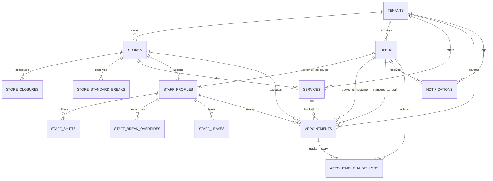

# PostgreSQL Database Design & Drizzle ORM Schema Specification

**Status:** Finalized & Architecture Approved · **Target Database:** PostgreSQL 15+ (Neon Serverless)  
**ORM:** Drizzle ORM (`drizzle-orm/pg-core`) · **Application:** Aura Multi-Tenant Salon Marketplace (Surat)

---

## 1. Architectural Philosophy & Design Principles

1. **Type-Safe Drizzle ORM First:**  
   Every table, relationship, index, and foreign key constraint is declared declaratively using `drizzle-orm/pg-core`. Type-safe TypeScript types are inferred directly from table schemas (`typeof users.$inferSelect`, `typeof appointments.$inferInsert`).
2. **PostgreSQL-Native Concurrency Guard (`btree_gist`):**  
   Zero race condition double-bookings. Concurrency conflicts are prevented at the database kernel level using PostgreSQL `tstzrange` intervals and `EXCLUDE USING GIST` constraints.
3. **Open Marketplace Multi-Tenancy:**  
   - **Tenants (`tenants`):** Independent salon brands (e.g., *Salon Bonanza*, *The Barber King*, *Envi Salon*).
   - **Customers (`users` where `role = 'CUSTOMER'`):** Platform-level marketplace accounts (`tenant_id = NULL`). Customers can discover and book at any salon across Surat without redundant sign-ups.
   - **Staff & Admins (`users` where `role IN ('STAFF', 'TENANT_ADMIN')`):** Strictly scoped to their respective `tenant_id`.
4. **Buffer-Aware Scheduling:**  
   Every service defines `duration_minutes` (client service time) and `buffer_minutes` (sanitization & station prep). The database `slot_range` interval encompasses the complete duration `[start, start + duration + buffer)` so subsequent bookings cannot collide during clean-up.
5. **Physical Station / Chair Capacity Bounds:**  
   Stores maintain a configured `total_styling_chairs`. In addition to stylist-level locks, floor capacity is verified to prevent salon overcrowding. Stylists are assigned a designated styling chair (e.g., Chair 01, Chair 02, Chair 03).
6. **Self-Service 2-Hour Cancellation Cutoff:**  
   Customers can cancel or reschedule appointments online if $\ge 2\text{ hours}$ before `lower(slot_range)`. When cancelled, the slot is immediately released and freed for other customers. Within 2 hours, self-service cancellation is locked.
7. **Direct Staff Provisioning (Frictionless Onboarding):**  
   Admins provision staff profiles directly (Name, Email `abc@gmail.com`, Branch, Station Chair). When `abc@gmail.com` signs in with their password, their stylist portal, shifts, and chair schedule activate automatically without third-party email/SMS invite dependencies.
8. **In-App Lifecycle & Zero External Dependencies:**  
   No third-party calendar or SMS invitations. All appointment passes, status updates (`BOOKED` $\to$ `CONFIRMED` $\to$ `IN_PROGRESS` $\to$ `COMPLETED`), notifications, and audit trails live strictly in-app.
9. **Zero VIP / Tiered Badges:**  
   Pure Aura SaaS minimalism. All customers receive standard, egalitarian service. No VIP, VVIP, or subscription loyalty tiers in database schemas or queries.

---

## 2. Entity-Relationship Diagram (ERD)



---

## 3. Drizzle ORM TypeScript Schema Specification (`src/db/schema.ts`)

```typescript
import { 
  pgTable, 
  uuid, 
  varchar, 
  text, 
  integer, 
  numeric, 
  boolean, 
  time, 
  date, 
  timestamp, 
  customType,
  uniqueIndex,
  index
} from 'drizzle-orm/pg-core';
import { relations, sql } from 'drizzle-orm';

// ============================================================================
// CUSTOM POSTGRESQL EXTENSION TYPES
// ============================================================================

/**
 * Custom PostgreSQL Range Type for [start, end) timestamp with time zone intervals.
 * Essential for overlap detection with EXCLUDE USING GIST.
 */
export const tstzrange = customType<{ data: string; driverData: string }>({
  dataType() {
    return 'tstzrange';
  },
});

// ============================================================================
// 1. TENANTS & USERS (AUTHENTICATION & RBAC)
// ============================================================================

export const tenants = pgTable('tenants', {
  id: uuid('id').defaultRandom().primaryKey(),
  name: varchar('name', { length: 150 }).notNull(),
  slug: varchar('slug', { length: 100 }).notNull().unique(), // e.g. "salon-bonanza"
  logoUrl: text('logo_url'),
  supportPhone: varchar('support_phone', { length: 30 }),
  supportEmail: varchar('support_email', { length: 255 }),
  isActive: boolean('is_active').default(true).notNull(),
  createdAt: timestamp('created_at', { withTimezone: true }).defaultNow().notNull(),
  updatedAt: timestamp('updated_at', { withTimezone: true }).defaultNow().notNull(),
});

export const users = pgTable('users', {
  id: uuid('id').defaultRandom().primaryKey(),
  // tenantId is NULL for open marketplace customers; set for salon staff & salon admins
  tenantId: uuid('tenant_id').references(() => tenants.id, { onDelete: 'cascade' }),
  email: varchar('email', { length: 255 }).notNull(),
  passwordHash: varchar('password_hash', { length: 255 }).notNull(),
  fullName: varchar('full_name', { length: 150 }).notNull(),
  phone: varchar('phone', { length: 30 }),
  role: varchar('role', { length: 30 })
    .$type<'TENANT_ADMIN' | 'STAFF' | 'CUSTOMER'>()
    .notNull(),
  isActive: boolean('is_active').default(true).notNull(),
  preferencesNotes: text('preferences_notes'), // Allergy warnings, preferred styles, scalp notes
  createdAt: timestamp('created_at', { withTimezone: true }).defaultNow().notNull(),
  updatedAt: timestamp('updated_at', { withTimezone: true }).defaultNow().notNull(),
}, (table) => ({
  tenantRoleIdx: index('idx_users_tenant_role').on(table.tenantId, table.role),
  emailUnique: uniqueIndex('uq_users_email_global').on(table.email),
  tenantEmailIdx: index('idx_users_tenant_email').on(table.tenantId, table.email),
}));

// ============================================================================
// 2. STORES / BRANCHES, CLOSURES & BREAKS
// ============================================================================

export const stores = pgTable('stores', {
  id: uuid('id').defaultRandom().primaryKey(),
  tenantId: uuid('tenant_id').references(() => tenants.id, { onDelete: 'cascade' }).notNull(),
  name: varchar('name', { length: 150 }).notNull(), // e.g. "Salon Bonanza - Althan Branch"
  slug: varchar('slug', { length: 100 }).notNull(), // e.g. "althan-branch"
  city: varchar('city', { length: 100 }).default('Surat').notNull(),
  locality: varchar('locality', { length: 100 }).notNull(), // e.g. "Althan", "Adajan", "Vesu"
  address: text('address').notNull(),
  landmark: varchar('landmark', { length: 150 }),
  phone: varchar('phone', { length: 30 }).notNull(),
  timezone: varchar('timezone', { length: 50 }).default('Asia/Kolkata').notNull(),
  openingTime: time('opening_time').default('09:00:00').notNull(),
  closingTime: time('closing_time').default('21:00:00').notNull(),
  weeklyOffDay: integer('weekly_off_day'), // 0 = Sunday, 1 = Monday ... 6 = Saturday (NULL = no weekly off)
  totalStylingChairs: integer('total_styling_chairs').default(5).notNull(),
  isActive: boolean('is_active').default(true).notNull(),
  createdAt: timestamp('created_at', { withTimezone: true }).defaultNow().notNull(),
  updatedAt: timestamp('updated_at', { withTimezone: true }).defaultNow().notNull(),
}, (table) => ({
  tenantIdx: index('idx_stores_tenant').on(table.tenantId),
  localityCityIdx: index('idx_stores_locality_city').on(table.city, table.locality),
  tenantSlugUnique: uniqueIndex('uq_store_tenant_slug').on(table.tenantId, table.slug),
}));

export const storeClosures = pgTable('store_closures', {
  id: uuid('id').defaultRandom().primaryKey(),
  storeId: uuid('store_id').references(() => stores.id, { onDelete: 'cascade' }).notNull(),
  closureDate: date('closure_date').notNull(),
  reason: varchar('reason', { length: 200 }).notNull(), // e.g. "Public Holiday (Diwali)", "Renovation"
  createdAt: timestamp('created_at', { withTimezone: true }).defaultNow().notNull(),
}, (table) => ({
  storeClosureUnique: uniqueIndex('uq_store_closure_date').on(table.storeId, table.closureDate),
  closureLookupIdx: index('idx_store_closures_lookup').on(table.storeId, table.closureDate),
}));

export const storeStandardBreaks = pgTable('store_standard_breaks', {
  id: uuid('id').defaultRandom().primaryKey(),
  storeId: uuid('store_id').references(() => stores.id, { onDelete: 'cascade' }).notNull(),
  title: varchar('title', { length: 100 }).default('Standard Lunch Break').notNull(),
  breakStart: time('break_start').notNull(), // e.g. '13:00:00'
  breakEnd: time('break_end').notNull(),     // e.g. '14:00:00'
}, (table) => ({
  storeBreakIdx: index('idx_store_breaks_store').on(table.storeId),
}));

// ============================================================================
// 3. SERVICES (CATALOG & CROSS-BRANCH CLONING)
// ============================================================================

export const services = pgTable('services', {
  id: uuid('id').defaultRandom().primaryKey(),
  tenantId: uuid('tenant_id').references(() => tenants.id, { onDelete: 'cascade' }).notNull(),
  storeId: uuid('store_id').references(() => stores.id, { onDelete: 'cascade' }).notNull(),
  category: varchar('category', { length: 100 }).default('Hair').notNull(), // 'Hair', 'Beard', 'Spa', 'Treatment'
  title: varchar('title', { length: 150 }).notNull(), // e.g. "Signature Precision Haircut"
  description: text('description'),
  durationMinutes: integer('duration_minutes').notNull(), // e.g. 45
  bufferMinutes: integer('buffer_minutes').default(5).notNull(), // e.g. 5 min sanitization buffer
  price: numeric('price', { precision: 10, scale: 2 }).notNull(), // in INR (e.g. 850.00)
  isActive: boolean('is_active').default(true).notNull(),
  createdAt: timestamp('created_at', { withTimezone: true }).defaultNow().notNull(),
  updatedAt: timestamp('updated_at', { withTimezone: true }).defaultNow().notNull(),
}, (table) => ({
  storeIdx: index('idx_services_store').on(table.storeId),
  tenantIdx: index('idx_services_tenant').on(table.tenantId),
  categoryIdx: index('idx_services_category').on(table.storeId, table.category),
}));

// ============================================================================
// 4. STAFF PROFILES, CHAIR ASSIGNMENTS, SHIFTS, BREAKS & LEAVES
// ============================================================================

export const staffProfiles = pgTable('staff_profiles', {
  id: uuid('id').defaultRandom().primaryKey(),
  userId: uuid('user_id').references(() => users.id, { onDelete: 'cascade' }).notNull().unique(),
  tenantId: uuid('tenant_id').references(() => tenants.id, { onDelete: 'cascade' }).notNull(),
  currentStoreId: uuid('current_store_id').references(() => stores.id).notNull(),
  title: varchar('title', { length: 100 }).default('Stylist').notNull(), // e.g. "Master Stylist", "Senior Colorist"
  assignedChair: integer('assigned_chair').default(1).notNull(), // Physical station number (1..N)
  chairStationName: varchar('chair_station_name', { length: 50 }).default('Chair 01').notNull(), // e.g. "Chair 03 (Wash Bay A)"
  bio: text('bio'),
  ratingAverage: numeric('rating_average', { precision: 3, scale: 2 }).default('4.90').notNull(),
  totalReviews: integer('total_reviews').default(0).notNull(),
  isActive: boolean('is_active').default(true).notNull(),
  createdAt: timestamp('created_at', { withTimezone: true }).defaultNow().notNull(),
  updatedAt: timestamp('updated_at', { withTimezone: true }).defaultNow().notNull(),
}, (table) => ({
  storeIdx: index('idx_staff_store').on(table.currentStoreId),
  tenantIdx: index('idx_staff_tenant').on(table.tenantId),
  storeChairUnique: uniqueIndex('uq_store_active_chair').on(table.currentStoreId, table.assignedChair),
}));

export const staffShifts = pgTable('staff_shifts', {
  id: uuid('id').defaultRandom().primaryKey(),
  staffId: uuid('staff_id').references(() => staffProfiles.id, { onDelete: 'cascade' }).notNull(),
  storeId: uuid('store_id').references(() => stores.id, { onDelete: 'cascade' }).notNull(),
  dayOfWeek: integer('day_of_week').notNull(), // 0 = Sunday, 1 = Monday ... 6 = Saturday
  shiftStart: time('shift_start').notNull(),  // e.g. '09:00:00'
  shiftEnd: time('shift_end').notNull(),      // e.g. '18:00:00'
  isWorkingDay: boolean('is_working_day').default(true).notNull(),
}, (table) => ({
  staffDayUnique: uniqueIndex('uq_staff_shift_day').on(table.staffId, table.dayOfWeek),
  storeDayIdx: index('idx_staff_shifts_store_day').on(table.storeId, table.dayOfWeek),
}));

export const staffBreakOverrides = pgTable('staff_break_overrides', {
  id: uuid('id').defaultRandom().primaryKey(),
  staffId: uuid('staff_id').references(() => staffProfiles.id, { onDelete: 'cascade' }).notNull(),
  title: varchar('title', { length: 100 }).default('Custom Break').notNull(),
  dayOfWeek: integer('day_of_week'), // NULL = applies to all working days, or 0..6
  breakStart: time('break_start').notNull(), // e.g. '15:30:00'
  breakEnd: time('break_end').notNull(),     // e.g. '16:00:00'
  isActive: boolean('is_active').default(true).notNull(),
}, (table) => ({
  staffBreakIdx: index('idx_staff_breaks_staff').on(table.staffId),
}));

export const staffLeaves = pgTable('staff_leaves', {
  id: uuid('id').defaultRandom().primaryKey(),
  staffId: uuid('staff_id').references(() => staffProfiles.id, { onDelete: 'cascade' }).notNull(),
  leaveDate: date('leave_date').notNull(),
  reason: text('reason'), // e.g. "Personal Emergency", "Planned Vacation"
  createdAt: timestamp('created_at', { withTimezone: true }).defaultNow().notNull(),
}, (table) => ({
  staffLeaveUnique: uniqueIndex('uq_staff_leave_date').on(table.staffId, table.leaveDate),
  leaveLookupIdx: index('idx_staff_leaves_lookup').on(table.staffId, table.leaveDate),
}));

// ============================================================================
// 5. APPOINTMENTS (WITH HARD POSTGRESQL CONCURRENCY LOCK)
// ============================================================================

export const appointments = pgTable('appointments', {
  id: uuid('id').defaultRandom().primaryKey(),
  tenantId: uuid('tenant_id').references(() => tenants.id).notNull(),
  storeId: uuid('store_id').references(() => stores.id).notNull(),
  staffId: uuid('staff_id').references(() => staffProfiles.id).notNull(),
  customerId: uuid('customer_id').references(() => users.id).notNull(),
  bookedByUserId: uuid('booked_by_user_id').references(() => users.id).notNull(), // Customer or Front Desk Staff
  serviceId: uuid('service_id').references(() => services.id).notNull(),
  assignedChair: integer('assigned_chair').notNull(), // Station chair locked for this appointment
  /**
   * slot_range: PostgreSQL tstzrange encompassing [start_time, end_time_with_buffer).
   * Guarded against double-booking via GiST exclusion constraint.
   */
  slotRange: tstzrange('slot_range').notNull(),
  status: varchar('status', { length: 30 })
    .$type<'CONFIRMED' | 'IN_PROGRESS' | 'COMPLETED' | 'CANCELLED' | 'NO_SHOW' | 'RESCHEDULE_NEEDED'>()
    .default('CONFIRMED')
    .notNull(),
  servicePrice: numeric('service_price', { precision: 10, scale: 2 }).notNull(),
  serviceDurationMinutes: integer('service_duration_minutes').notNull(),
  bufferMinutes: integer('buffer_minutes').default(5).notNull(),
  customerNotes: text('customer_notes'),
  staffInternalNotes: text('staff_internal_notes'),
  createdAt: timestamp('created_at', { withTimezone: true }).defaultNow().notNull(),
  updatedAt: timestamp('updated_at', { withTimezone: true }).defaultNow().notNull(),
}, (table) => ({
  lookupIdx: index('idx_appointments_lookup').on(table.staffId, table.storeId, table.status),
  customerIdx: index('idx_appointments_customer').on(table.customerId),
  storeStatusIdx: index('idx_appointments_store_status').on(table.storeId, table.status),
}));

// ============================================================================
// 6. IN-APP NOTIFICATIONS & AUDIT TRAIL
// ============================================================================

export const notifications = pgTable('notifications', {
  id: uuid('id').defaultRandom().primaryKey(),
  tenantId: uuid('tenant_id').references(() => tenants.id, { onDelete: 'cascade' }).notNull(),
  recipientUserId: uuid('recipient_user_id').references(() => users.id, { onDelete: 'cascade' }).notNull(),
  title: varchar('title', { length: 200 }).notNull(),
  message: text('message').notNull(),
  type: varchar('type', { length: 50 })
    .$type<'BOOKING_CONFIRMED' | 'STATUS_UPDATED' | 'APPOINTMENT_CANCELLED' | 'RESCHEDULE_NEEDED' | 'STAFF_PROVISIONED'>()
    .notNull(),
  entityId: uuid('entity_id'), // Appointment ID or Store ID
  isRead: boolean('is_read').default(false).notNull(),
  createdAt: timestamp('created_at', { withTimezone: true }).defaultNow().notNull(),
}, (table) => ({
  recipientIdx: index('idx_notifications_recipient').on(table.recipientUserId, table.isRead, table.createdAt),
}));

export const appointmentAuditLogs = pgTable('appointment_audit_logs', {
  id: uuid('id').defaultRandom().primaryKey(),
  appointmentId: uuid('appointment_id').references(() => appointments.id, { onDelete: 'cascade' }).notNull(),
  action: varchar('action', { length: 50 }).notNull(), // 'CREATED', 'STATUS_CHANGE', 'CANCELLED', 'RESCHEDULED', 'STAFF_TRANSFERRED'
  actorRole: varchar('actor_role', { length: 30 }).$type<'CUSTOMER' | 'STAFF' | 'ADMIN' | 'SYSTEM'>().notNull(),
  actorId: uuid('actor_id').references(() => users.id).notNull(),
  oldStatus: varchar('old_status', { length: 30 }),
  newStatus: varchar('new_status', { length: 30 }),
  oldStoreId: uuid('old_store_id').references(() => stores.id),
  newStoreId: uuid('new_store_id').references(() => stores.id),
  oldStaffId: uuid('old_staff_id').references(() => staffProfiles.id),
  newStaffId: uuid('new_staff_id').references(() => staffProfiles.id),
  oldSlotRange: tstzrange('old_slot_range'),
  newSlotRange: tstzrange('new_slot_range'),
  notes: text('notes'),
  createdAt: timestamp('created_at', { withTimezone: true }).defaultNow().notNull(),
}, (table) => ({
  auditAptIdx: index('idx_audit_logs_appointment').on(table.appointmentId, table.createdAt),
}));

// ============================================================================
// 7. DRIZZLE RELATIONS GRAPH
// ============================================================================

export const tenantsRelations = relations(tenants, ({ many }) => ({
  stores: many(stores),
  users: many(users),
  services: many(services),
}));

export const storesRelations = relations(stores, ({ many, one }) => ({
  tenant: one(tenants, { fields: [stores.tenantId], references: [tenants.id] }),
  services: many(services),
  staff: many(staffProfiles),
  appointments: many(appointments),
  closures: many(storeClosures),
  standardBreaks: many(storeStandardBreaks),
}));

export const usersRelations = relations(users, ({ one, many }) => ({
  tenant: one(tenants, { fields: [users.tenantId], references: [tenants.id] }),
  staffProfile: one(staffProfiles, { fields: [users.id], references: [staffProfiles.userId] }),
  customerAppointments: many(appointments, { relationName: 'customerAppointments' }),
  staffBookedAppointments: many(appointments, { relationName: 'staffBookedAppointments' }),
  notifications: many(notifications),
}));

export const servicesRelations = relations(services, ({ one }) => ({
  store: one(stores, { fields: [services.storeId], references: [stores.id] }),
  tenant: one(tenants, { fields: [services.tenantId], references: [tenants.id] }),
}));

export const staffProfilesRelations = relations(staffProfiles, ({ one, many }) => ({
  user: one(users, { fields: [staffProfiles.userId], references: [users.id] }),
  store: one(stores, { fields: [staffProfiles.currentStoreId], references: [stores.id] }),
  tenant: one(tenants, { fields: [staffProfiles.tenantId], references: [tenants.id] }),
  shifts: many(staffShifts),
  breakOverrides: many(staffBreakOverrides),
  leaves: many(staffLeaves),
  appointments: many(appointments),
}));

export const appointmentsRelations = relations(appointments, ({ one, many }) => ({
  customer: one(users, { fields: [appointments.customerId], references: [users.id], relationName: 'customerAppointments' }),
  bookedBy: one(users, { fields: [appointments.bookedByUserId], references: [users.id], relationName: 'staffBookedAppointments' }),
  staff: one(staffProfiles, { fields: [appointments.staffId], references: [staffProfiles.id] }),
  store: one(stores, { fields: [appointments.storeId], references: [stores.id] }),
  service: one(services, { fields: [appointments.serviceId], references: [services.id] }),
  auditLogs: many(appointmentAuditLogs),
}));

export const appointmentAuditLogsRelations = relations(appointmentAuditLogs, ({ one }) => ({
  appointment: one(appointments, { fields: [appointmentAuditLogs.appointmentId], references: [appointments.id] }),
  actor: one(users, { fields: [appointmentAuditLogs.actorId], references: [users.id] }),
}));

export const notificationsRelations = relations(notifications, ({ one }) => ({
  recipient: one(users, { fields: [notifications.recipientUserId], references: [users.id] }),
}));
```

---

## 4. PostgreSQL Native Extensions & Concurrency Constraints

To prevent double-booking at 100% database-guaranteed concurrency safety, run this SQL migration before initial data seeding:

```sql
-- 1. Enable btree_gist extension for combining UUID/Integer equality with tstzrange overlap
CREATE EXTENSION IF NOT EXISTS btree_gist;

-- 2. Concurrency Lock 1: Prevent overlapping appointments for the SAME STYLIST
ALTER TABLE appointments 
ADD CONSTRAINT no_overlapping_staff_appointments
EXCLUDE USING GIST (
  staff_id WITH =, 
  slot_range WITH &&
) 
WHERE (status IN ('CONFIRMED', 'IN_PROGRESS'));

-- 3. Concurrency Lock 2: Prevent overlapping appointments for the SAME PHYSICAL CHAIR IN A STORE
ALTER TABLE appointments 
ADD CONSTRAINT no_overlapping_chair_appointments
EXCLUDE USING GIST (
  store_id WITH =,
  assigned_chair WITH =,
  slot_range WITH &&
) 
WHERE (status IN ('CONFIRMED', 'IN_PROGRESS'));
```

### Why this is mathematically bulletproof:
- If two concurrent requests attempt to book the exact same stylist or physical chair for overlapping intervals `[14:00, 14:50)` and `[14:30, 15:15)`, the PostgreSQL GiST index rejects the second transaction with error code `23P01` (`exclusion_violation`).
- Cancelled (`CANCELLED`), no-show (`NO_SHOW`), or rescheduled (`RESCHEDULE_NEEDED`) bookings are excluded by the `WHERE` clause, automatically freeing the time slot for others immediately upon status change.

---

## 5. Core Business Operations & Drizzle ORM Queries

### 5.1 Dynamic Slot Availability Engine
Calculates available slots for a stylist on a given date by subtracting shifts, store closures, breaks, staff leaves, and existing bookings.

```typescript
export async function calculateAvailableSlots(
  db: DrizzleDB,
  params: {
    storeId: string;
    staffId: string;
    serviceId: string;
    date: string; // 'YYYY-MM-DD'
  }
) {
  const targetDate = new Date(params.date);
  const dayOfWeek = targetDate.getUTCDay(); // 0..6

  // 1. Check Store Closure
  const closure = await db.query.storeClosures.findFirst({
    where: (sc, { and, eq }) => and(eq(sc.storeId, params.storeId), eq(sc.closureDate, params.date)),
  });
  if (closure) return { available: false, reason: `Store closed: ${closure.reason}`, slots: [] };

  // 2. Check Staff Leave
  const leave = await db.query.staffLeaves.findFirst({
    where: (sl, { and, eq }) => and(eq(sl.staffId, params.staffId), eq(sl.leaveDate, params.date)),
  });
  if (leave) return { available: false, reason: 'Stylist on approved leave', slots: [] };

  // 3. Fetch Staff Shift
  const shift = await db.query.staffShifts.findFirst({
    where: (ss, { and, eq }) => and(
      eq(ss.staffId, params.staffId),
      eq(ss.storeId, params.storeId),
      eq(ss.dayOfWeek, dayOfWeek),
      eq(ss.isWorkingDay, true)
    ),
  });
  if (!shift) return { available: false, reason: 'Stylist regular day off', slots: [] };

  // 4. Fetch Service Duration + Prep Buffer
  const service = await db.query.services.findFirst({
    where: (s, { eq }) => eq(s.id, params.serviceId),
  });
  if (!service) throw new Error('Service not found');
  const totalSlotDuration = service.durationMinutes + service.bufferMinutes; // e.g. 45 + 5 = 50 min

  // 5. Fetch Existing Confirmed / In-Progress Appointments for this Stylist
  const dayStart = `${params.date}T00:00:00.000Z`;
  const dayEnd = `${params.date}T23:59:59.999Z`;

  const existingBookings = await db.query.appointments.findMany({
    where: (apt, { and, eq, inArray }) => and(
      eq(apt.staffId, params.staffId),
      inArray(apt.status, ['CONFIRMED', 'IN_PROGRESS']),
      sql`slot_range && tstzrange(${dayStart}, ${dayEnd}, '[]')`
    ),
  });

  // 6. Generate candidate slots in 15-minute increments between shiftStart and shiftEnd
  // and filter out slots colliding with standard lunch breaks or existingBookings
  return generateCandidateSlots({
    shiftStart: shift.shiftStart,
    shiftEnd: shift.shiftEnd,
    slotDurationMinutes: totalSlotDuration,
    existingBookings,
    targetDate: params.date,
  });
}
```

---

### 5.2 Atomic Booking Creation
```typescript
export async function createAppointment(
  db: DrizzleDB,
  data: {
    tenantId: string;
    storeId: string;
    staffId: string;
    customerId: string;
    bookedByUserId: string;
    serviceId: string;
    startTime: Date;
    actorRole: 'CUSTOMER' | 'STAFF' | 'ADMIN';
    customerNotes?: string;
  }
) {
  return await db.transaction(async (tx) => {
    // 1. Fetch Service metadata for price and duration
    const service = await tx.query.services.findFirst({
      where: (s, { eq }) => eq(s.id, data.serviceId),
    });
    if (!service) throw new Error('Service not found');

    // 2. Fetch Stylist Assigned Chair
    const staff = await tx.query.staffProfiles.findFirst({
      where: (sp, { eq }) => eq(sp.id, data.staffId),
    });
    if (!staff) throw new Error('Stylist profile not found');

    const totalMinutes = service.durationMinutes + service.bufferMinutes;
    const endTime = new Date(data.startTime.getTime() + totalMinutes * 60 * 1000);

    // 3. Insert Appointment (Database GiST constraint will throw on conflict)
    const [booking] = await tx.insert(appointments).values({
      tenantId: data.tenantId,
      storeId: data.storeId,
      staffId: data.staffId,
      customerId: data.customerId,
      bookedByUserId: data.bookedByUserId,
      serviceId: data.serviceId,
      assignedChair: staff.assignedChair,
      slotRange: sql`tstzrange(${data.startTime.toISOString()}, ${endTime.toISOString()}, '[)')`,
      status: 'CONFIRMED',
      servicePrice: service.price,
      serviceDurationMinutes: service.durationMinutes,
      bufferMinutes: service.bufferMinutes,
      customerNotes: data.customerNotes,
    }).returning();

    // 4. Record Audit Log
    await tx.insert(appointmentAuditLogs).values({
      appointmentId: booking.id,
      action: 'CREATED',
      actorRole: data.actorRole,
      actorId: data.bookedByUserId,
      newStatus: 'CONFIRMED',
      newStoreId: data.storeId,
      newStaffId: data.staffId,
      newSlotRange: sql`tstzrange(${data.startTime.toISOString()}, ${endTime.toISOString()}, '[)')`,
      notes: data.actorRole === 'STAFF' 
        ? 'Quick booking created by salon front desk' 
        : 'Self-service booking confirmed via Aura marketplace',
    });

    // 5. In-App Notification
    await tx.insert(notifications).values({
      tenantId: data.tenantId,
      recipientUserId: data.customerId,
      title: 'Appointment Confirmed',
      message: `Your booking at ${service.title} is locked for ${data.startTime.toLocaleDateString()}. Chair & slot guaranteed.`,
      type: 'BOOKING_CONFIRMED',
      entityId: booking.id,
    });

    return booking;
  });
}
```

---

### 5.3 Self-Service Cancellation with 2-Hour Guard
Enforces the mandatory rule: cancellations $\ge 2\text{ hours}$ before start time are processed immediately and free the chair slot; cancellations within 2 hours are rejected.

```typescript
export async function cancelAppointmentCustomer(
  db: DrizzleDB,
  appointmentId: string,
  customerId: string,
  cancellationReason?: string
) {
  return await db.transaction(async (tx) => {
    // 1. Fetch current appointment and verify ownership
    const apt = await tx.query.appointments.findFirst({
      where: (a, { and, eq }) => and(eq(a.id, appointmentId), eq(a.customerId, customerId)),
    });
    if (!apt) throw new Error('Appointment not found or unauthorized');

    if (apt.status === 'CANCELLED') throw new Error('Appointment is already cancelled');
    if (apt.status === 'COMPLETED') throw new Error('Completed appointments cannot be cancelled');

    // 2. Strict 2-Hour Cutoff Verification in SQL
    const [windowCheck] = await tx.execute<{ canCancel: boolean; hoursRemaining: number }>(sql`
      SELECT 
        (lower(slot_range) >= NOW() + INTERVAL '2 hours') AS "canCancel",
        EXTRACT(EPOCH FROM (lower(slot_range) - NOW())) / 3600.0 AS "hoursRemaining"
      FROM appointments
      WHERE id = ${appointmentId}
    `);

    if (!windowCheck?.canCancel) {
      throw new Error(
        'Cancellation locked: Appointments within 2 hours of scheduled start time cannot be cancelled self-service. Please contact the salon front desk directly.'
      );
    }

    // 3. Update Status to CANCELLED (frees GiST constraint immediately)
    const [updated] = await tx.update(appointments)
      .set({ 
        status: 'CANCELLED', 
        updatedAt: new Date() 
      })
      .where(eq(appointments.id, appointmentId))
      .returning();

    // 4. Audit Log
    await tx.insert(appointmentAuditLogs).values({
      appointmentId,
      action: 'CANCELLED',
      actorRole: 'CUSTOMER',
      actorId: customerId,
      oldStatus: apt.status,
      newStatus: 'CANCELLED',
      notes: cancellationReason || 'Customer self-service cancellation via booking history (>2hr notice)',
    });

    // 5. In-App Notification
    await tx.insert(notifications).values({
      tenantId: apt.tenantId,
      recipientUserId: customerId,
      title: 'Appointment Cancelled',
      message: 'Your appointment was successfully cancelled. Your reserved chair slot has been freed.',
      type: 'APPOINTMENT_CANCELLED',
      entityId: appointmentId,
    });

    return { success: true, appointment: updated };
  });
}
```

---

### 5.4 Admin Direct Staff Provisioning (`abc@gmail.com`)
Directly creates the staff user and profile without email/SMS invite dependencies.

```typescript
export async function provisionStaffMember(
  db: DrizzleDB,
  params: {
    tenantId: string;
    adminUserId: string;
    fullName: string;
    email: string;
    temporaryPasswordHash: string;
    storeId: string;
    primaryRoleTitle: string; // e.g. "Senior Stylist"
    assignedChair: number;    // e.g. 2
    chairStationName: string; // e.g. "Chair 02"
    shiftTemplate: {
      daysOfWeek: number[];   // [1, 2, 3, 4, 5]
      shiftStart: string;     // '09:00:00'
      shiftEnd: string;       // '18:00:00'
    };
  }
) {
  return await db.transaction(async (tx) => {
    // 1. Create or Find User
    let [user] = await tx.insert(users).values({
      tenantId: params.tenantId,
      email: params.email.toLowerCase().trim(),
      passwordHash: params.temporaryPasswordHash,
      fullName: params.fullName,
      role: 'STAFF',
      isActive: true,
    }).onConflictDoUpdate({
      target: users.email,
      set: { role: 'STAFF', tenantId: params.tenantId, updatedAt: new Date() },
    }).returning();

    // 2. Create Staff Profile
    const [profile] = await tx.insert(staffProfiles).values({
      userId: user.id,
      tenantId: params.tenantId,
      currentStoreId: params.storeId,
      title: params.primaryRoleTitle,
      assignedChair: params.assignedChair,
      chairStationName: params.chairStationName,
      isActive: true,
    }).returning();

    // 3. Insert Weekly Shift Schedules
    const shiftsToInsert = params.shiftTemplate.daysOfWeek.map((day) => ({
      staffId: profile.id,
      storeId: params.storeId,
      dayOfWeek: day,
      shiftStart: params.shiftTemplate.shiftStart,
      shiftEnd: params.shiftTemplate.shiftEnd,
      isWorkingDay: true,
    }));
    await tx.insert(staffShifts).values(shiftsToInsert);

    // 4. In-App Notification for Staff
    await tx.insert(notifications).values({
      tenantId: params.tenantId,
      recipientUserId: user.id,
      title: 'Stylist Account Activated',
      message: `Welcome to ${params.primaryRoleTitle} at Salon Bonanza. Your profile and chair schedule are active.`,
      type: 'STAFF_PROVISIONED',
      entityId: profile.id,
    });

    return { user, profile };
  });
}
```

---

## 6. Surat Marketplace Seed Data Blueprint

To provide immediate, photorealistic verification when developing the application, the database is pre-seeded with canonical Surat salon data matching the Stitch designs:

### 6.1 Tenants
1. **Salon Bonanza** (`slug: salon-bonanza`) — Luxury multi-branch atelier
2. **The Barber King** (`slug: the-barber-king`) — Classic men's grooming lounge
3. **Envi Salon & Spa** (`slug: envi-salon`) — Premium wellness & hair spa

### 6.2 Stores & Branches (Surat)
1. **Salon Bonanza (Althan Branch)**:
   - Address: *Shop 104–106, 1st Floor, Milano Plaza, VIP Road, Althan, Surat, Gujarat 395017*
   - Chairs: 5 stations · Hours: `09:00:00` – `21:00:00` · Weekly Off: None
2. **Salon Bonanza (Adajan Branch)**:
   - Address: *2nd Floor, River Palace, Near LP Savani Circle, Adajan, Surat, Gujarat 395009*
   - Chairs: 6 stations · Hours: `09:00:00` – `21:00:00` · Weekly Off: Tuesday (`weekly_off_day = 2`)
3. **Salon Bonanza (Vesu Branch)**:
   - Address: *G-12, Solitaire Business Hub, VIP Road, Vesu, Surat, Gujarat 395007*
   - Chairs: 4 stations · Hours: `10:00:00` – `22:00:00` · Weekly Off: None

### 6.3 Staff Profiles & Designated Chairs
1. **Rahul Mehta** (`rahul@salonbonanza.com`): Master Stylist · Althan Branch · Designated **Chair 03 (Wash Bay A)** · Rating: `4.9` (142 reviews)
2. **Priya Desai** (`priya@salonbonanza.com`): Senior Colorist · Althan Branch · Designated **Chair 01** · Rating: `4.8` (98 reviews)
3. **Sameer Qureshi** (`sameer@thebarberking.com`): Master Barber · Adajan Branch · Designated **Chair 02** · Rating: `4.9` (210 reviews)
4. **Rahul Sharma** (`abc@gmail.com`): Senior Stylist (Newly Provisioned) · Althan Branch · Designated **Chair 02**

### 6.4 Services & Buffers
1. **Signature Precision Haircut**: 45 min service + 5 min buffer = 50 min total · ₹850
2. **Classic Hot Towel Shave & Beard Sculpt**: 30 min service + 5 min buffer = 35 min total · ₹450
3. **Balayage & Hair Gloss Treatment**: 90 min service + 10 min buffer = 100 min total · ₹4,500
4. **Botanical Scalp & Hair Spa**: 60 min service + 5 min buffer = 65 min total · ₹1,600

### 6.5 Demo Logins (Default Password: `Password@123`)
* **Marketplace Customer**: `sarah@example.com`
* **Salon Admin**: `admin@salonbonanza.com`
* **Stylist**: `rahul@salonbonanza.com`
* **Newly Provisioned Staff**: `abc@gmail.com`

---

## 7. Migration & Deployment Sequence

1. `npm install drizzle-orm pg postgres`
2. `npm install -D drizzle-kit @types/pg`
3. Generate initial migration: `npx drizzle-kit generate`
4. Apply custom SQL extension: `CREATE EXTENSION IF NOT EXISTS btree_gist;` and `ADD CONSTRAINT` queries.
5. Push schema to PostgreSQL: `npx drizzle-kit migrate`
6. Run database seed script: `npx tsx src/db/seed.ts`
