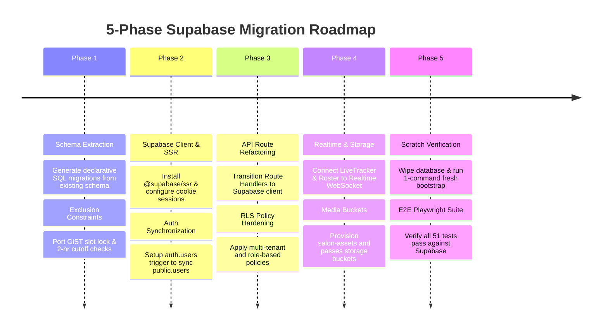

# Aura Salon Marketplace: Supabase Migration & Open-Source Roadmap

This document outlines the architectural transition from **Drizzle ORM + raw/local PostgreSQL** to a **full-stack Supabase backend**, optimized for high performance, zero-friction open-source onboarding, and real-time appointment tracking.

---

## 1. Executive Summary & Why Supabase Fits Aura

| Dimension | Current Stack (Drizzle + Local Postgres) | Proposed Supabase Architecture | Impact for Aura |
| :--- | :--- | :--- | :--- |
| **Authentication** | Custom HMAC PBKDF2 signed cookies in `auth.ts` | **Supabase Auth (`@supabase/ssr`)** | Built-in secure session rotation, OAuth (Google/Apple), password reset, and automatic JWT propagation. |
| **Database & Engine** | Local PostgreSQL with custom connection pool | **Supabase Managed Postgres (v15+)** | Same robust Postgres engine with native connection pooling (Supavisor), automated backups, and extensions. |
| **Concurrency Guard** | PostgreSQL `btree_gist` exclusion constraint | **PostgreSQL `btree_gist` + RLS** | Zero double-booking guarantee preserved at the engine level with database-enforced multi-tenant isolation. |
| **Live Updates** | HTTP polling on pass tracker and roster | **Supabase Realtime (`postgres_changes`)** | Instant delivery-style status updates (`CONFIRMED` $\to$ `IN_PROGRESS` $\to$ `COMPLETED`) with zero polling lag. |
| **Media / Assets** | External URLs / static files | **Supabase Storage** | S3-compatible buckets for salon storefront photos, stylist avatars, and receipts. |
| **Open Source Setup** | Manual database provisioning & connection string | **Supabase CLI (`npx supabase`)** | Contributors can run `npx supabase start && npx supabase db reset` to spin up the exact database in 60s. |

---

## 2. Core Supabase Capabilities Mapped to Aura

```mermaid
graph TD
    Client[Next.js 14 App Router] -->|@supabase/ssr| S_Auth[Supabase Auth]
    Client -->|Type-Safe Client / PostgREST| S_DB[(Supabase PostgreSQL)]
    Client -->|WebSocket| S_RT[Supabase Realtime]
    Client -->|Storage API| S_Store[Supabase Storage]

    subgraph "Supabase Managed Backend"
        S_Auth -->|auth.users trigger| Profiles[public.users / profiles]
        S_DB -->|btree_gist constraint| Lock[Zero Double-Booking Guard]
        S_DB -->|RLS Policies| Security[Multi-Tenant & Role Isolation]
        S_DB -->|WAL Replication| S_RT
    end
```

### 2.1 Supabase Auth, Google OAuth / SSO & Unified Role Redirection
- **Unified Sign-In (Aura Minimalist Style)**: Strictly zero role tabs. Both Google SSO and Email/Password live on a single unified card for Customers, Stylists, and Salon Admins.
- **Google SSO Flow Architecture**:
  ```mermaid
  sequenceDiagram
      autonumber
      actor User as Customer / Staff / Admin
      participant UI as Next.js UI (SignInCard)
      participant SB_Auth as Supabase Auth (GoTrue)
      participant Google as Google OAuth 2.0
      participant Callback as /auth/callback Route Handler
      participant DB as Supabase Postgres (public.users)

      User->>UI: Clicks "Continue with Google"
      UI->>SB_Auth: supabase.auth.signInWithOAuth({ provider: 'google', redirectTo: '/auth/callback' })
      SB_Auth->>Google: Redirects to Google Consent Screen
      Google-->>User: Prompts Google Account Selection
      User->>Google: Grants Consent
      Google-->>SB_Auth: Returns OAuth code to Supabase
      SB_Auth-->>Callback: Redirects with ?code=...
      Callback->>SB_Auth: exchangeCodeForSession(code)
      SB_Auth->>DB: Trigger: on_auth_user_created()
      Note over DB: Creates public.users row with Google avatar, name & role='CUSTOMER'
      Callback-->>UI: Reads role & redirects (/admin, /staff, or /appointments)
  ```
- **Google Cloud Console & Supabase Configuration**:
  1. Google Cloud Console > APIs & Services > Credentials:
     - Application Type: *Web Application*.
     - Authorized JavaScript Origins: `http://localhost:3000` & production domain.
     - Authorized Redirect URI: `https://nncmxnqlvsqucbftlvnk.supabase.co/auth/v1/callback`.
  2. Supabase Dashboard > Authentication > Providers > Google:
     - Client ID & Client Secret configured.
     - Enable "Skip nonce check" if using server-side PKCE exchange.
- **OAuth Callback Route (`src/app/auth/callback/route.ts`)**:
  ```typescript
  import { createServerClient } from '@supabase/ssr';
  import { cookies } from 'next/headers';
  import { NextResponse } from 'next/server';

  export async function GET(request: Request) {
    const { searchParams, origin } = new URL(request.url);
    const code = searchParams.get('code');
    const next = searchParams.get('next') ?? '/';

    if (code) {
      const cookieStore = cookies();
      const supabase = createServerClient(
        process.env.NEXT_PUBLIC_SUPABASE_URL!,
        process.env.NEXT_PUBLIC_SUPABASE_ANON_KEY!,
        {
          cookies: {
            getAll() { return cookieStore.getAll(); },
            setAll(cookiesToSet) {
              cookiesToSet.forEach(({ name, value, options }) =>
                cookieStore.set(name, value, options)
              );
            },
          },
        }
      );

      const { data: { session }, error } = await supabase.auth.exchangeCodeForSession(code);
      if (!error && session?.user) {
        // Query user role from public.users to determine destination
        const { data: profile } = await supabase
          .from('users')
          .select('role')
          .eq('id', session.user.id)
          .single();

        if (profile?.role === 'TENANT_ADMIN') return NextResponse.redirect(`${origin}/admin`);
        if (profile?.role === 'STAFF') return NextResponse.redirect(`${origin}/staff`);
        return NextResponse.redirect(`${origin}/appointments`);
      }
    }
    return NextResponse.redirect(`${origin}/login?error=auth_failed`);
  }
  ```
- **Automated Profile Sync Trigger (`public.users`)**:
  ```sql
  CREATE OR REPLACE FUNCTION public.handle_new_user()
  RETURNS TRIGGER AS $$
  BEGIN
    INSERT INTO public.users (id, email, full_name, avatar_url, role, created_at)
    VALUES (
      NEW.id,
      NEW.email,
      COALESCE(NEW.raw_user_meta_data->>'full_name', NEW.raw_user_meta_data->>'name', split_part(NEW.email, '@', 1)),
      NEW.raw_user_meta_data->>'avatar_url',
      COALESCE((NEW.raw_app_meta_data->>'role')::public.user_role, 'CUSTOMER'),
      NOW()
    )
    ON CONFLICT (id) DO UPDATE SET
      avatar_url = EXCLUDED.avatar_url,
      full_name = CASE WHEN public.users.full_name IS NULL THEN EXCLUDED.full_name ELSE public.users.full_name END;
    RETURN NEW;
  END;
  $$ LANGUAGE plpgsql SECURITY DEFINER;

  CREATE OR REPLACE TRIGGER on_auth_user_created
    AFTER INSERT ON auth.users
    FOR EACH ROW EXECUTE FUNCTION public.handle_new_user();
  ```
- **Next.js Middleware Integration**: Using `@supabase/ssr`, `middleware.ts` automatically refreshes the session cookie on every request and protects `/admin`, `/staff`, and `/profile` routes based on user role claims.

### 2.2 PostgreSQL GiST Exclusion Constraint (Zero Overbooking)
Supabase supports native PostgreSQL extensions. Aura's core rule—**zero simultaneous double-bookings on the same physical chair station**—remains strictly enforced via `btree_gist`:

```sql
CREATE EXTENSION IF NOT EXISTS btree_gist;

ALTER TABLE appointments
ADD CONSTRAINT uq_no_chair_double_booking
EXCLUDE USING gist (
  store_id WITH =,
  assigned_chair WITH =,
  slot_range WITH &&
)
WHERE (status IN ('CONFIRMED', 'IN_PROGRESS'));
```

### 2.3 Row Level Security (RLS) Policies
Rather than relying solely on API middleware checks, Supabase enforces security at the query layer:

```sql
-- Enable RLS
ALTER TABLE appointments ENABLE ROW LEVEL SECURITY;

-- 1. Customers can view and insert their own appointments
CREATE POLICY "Customers view own bookings" ON appointments
  FOR SELECT TO authenticated
  USING ((SELECT auth.uid()) = customer_id);

-- 2. Stylists can view all appointments for their branch
CREATE POLICY "Staff view store roster" ON appointments
  FOR SELECT TO authenticated
  USING (
    EXISTS (
      SELECT 1 FROM staff_profiles
      WHERE staff_profiles.user_id = auth.uid()
        AND staff_profiles.current_store_id = appointments.store_id
    )
  );

-- 3. Customers can cancel/reschedule strictly outside 2-hour window
CREATE POLICY "Customer cancel >2hr only" ON appointments
  FOR UPDATE TO authenticated
  USING (
    (SELECT auth.uid()) = customer_id
    AND lower(slot_range) >= NOW() + INTERVAL '2 hours'
  )
  WITH CHECK (
    status IN ('CANCELLED')
  );
```

### 2.4 Supabase Realtime Subscriptions
The 4-step live visual tracker on [`/appointments/[id]`](file:///Users/krushang/Desktop/Test/Booking/src/app/appointments/%5Bid%5D/page.tsx) and the stylist queue on [`/staff`](file:///Users/krushang/Desktop/Test/Booking/src/app/staff/page.tsx) subscribe directly to PostgreSQL write-ahead logs (WAL):

```typescript
// Instant delivery-style tracking without polling
const channel = supabase
  .channel(`pass-${appointmentId}`)
  .on(
    'postgres_changes',
    {
      event: 'UPDATE',
      schema: 'public',
      table: 'appointments',
      filter: `id=eq.${appointmentId}`,
    },
    (payload) => {
      setAppointmentStatus(payload.new.status);
    }
  )
  .subscribe();
```

---

## 3. Open-Source Developer Experience (The 1-Command Setup)

For any open-source contributor or salon operator cloning the repository, table creation and migrations must work out of the box without manual SQL clicks:

```
aura-salon-marketplace/
├── supabase/
│   ├── config.toml           # Supabase CLI configuration
│   ├── migrations/
│   │   ├── 20261002000000_enable_extensions.sql
│   │   ├── 20261002000001_core_marketplace_schema.sql
│   │   ├── 20261002000002_gist_concurrency_guard.sql
│   │   └── 20261002000003_rls_security_policies.sql
│   └── seed.sql              # Clean Surat demo dataset (Bonanza, Sarah, Rahul, Admin)
├── src/
│   └── lib/
│       └── supabase/
│           ├── client.ts     # createBrowserClient (@supabase/ssr)
│           ├── server.ts     # createServerClient (@supabase/ssr)
│           └── admin.ts      # createClient with SUPABASE_SERVICE_ROLE_KEY
└── package.json              # npm run db:setup / npm run db:reset
```

### Quick-Start Options for Open Source:

```bash
# Option A: Local Development (Docker-based, fully offline)
npx supabase start           # Starts local Postgres, Auth, Studio on :54323
npx supabase db reset         # Runs all migrations + seeds Surat demo data

# Option B: Cloud Supabase Project (Zero local Docker required)
npm run db:setup             # Runs declarative migrations & seeds against SUPABASE_URL
```

---

## 4. Phased Migration Roadmap



### Phase 1: Declarative Schema & Migrations Extraction
1. Extract all existing tables (`tenants`, `stores`, `users`, `services`, `staff_profiles`, `staff_shifts`, `appointments`, `appointment_audit_logs`, `notifications`) into standard SQL migrations under `supabase/migrations/`.
2. Ensure column constraints (`is_published`, `assigned_chair`, `slot_range`) and `btree_gist` exclusion locks are self-contained.
3. Write `supabase/seed.sql` containing the Surat dataset.

### Phase 2: Supabase SDK, `@supabase/ssr` & Google SSO Activation
1. Install `@supabase/supabase-js` and `@supabase/ssr`.
2. Configure `createBrowserClient` and `createServerClient` in `src/lib/supabase/`.
3. Enable Google Provider in Supabase Auth with Google Cloud OAuth Client ID & Secret.
4. Implement `/auth/callback` PKCE exchange Route Handler (`src/app/auth/callback/route.ts`).
5. Configure `src/middleware.ts` for automatic token refresh and protected route guarding.
6. Add PostgreSQL trigger: automatically insert/upsert a row into `public.users` whenever a user registers through Supabase Auth or logs in via Google SSO.
7. Update `SignInCard.tsx` with "Continue with Google" button and hairline divider.

### Phase 3: Route Handler & Business Logic Migration
1. Update `/api/auth/login`, `/api/auth/register`, and `/api/auth/logout` to call Supabase Auth APIs.
2. Refactor `/api/booking/slots` to calculate 15-minute slot intervals querying the Supabase database.
3. Refactor `/api/booking/create`, `/api/booking/cancel`, and `/api/booking/reschedule` with RLS validation and notification logging.

### Phase 4: Realtime Integration & Storage
1. Enable Realtime on `appointments` table in Supabase.
2. Replace polling in [`DigitalPassCard.tsx`](file:///Users/krushang/Desktop/Test/Booking/src/components/appointments/DigitalPassCard.tsx) and [`DailyRosterView.tsx`](file:///Users/krushang/Desktop/Test/Booking/src/components/staff/DailyRosterView.tsx) with live WebSocket events.
3. Create public bucket `salon-assets` for store banners and stylist avatars.

### Phase 5: Scratch Wipeout & Full Suite Verification
1. Completely reset the database from scratch using `npx supabase db reset` (or a dedicated `npm run db:reset` script).
2. Validate that open-source contributors can start the app without errors on an uninitialized environment.
3. Execute the full **51-test Playwright E2E suite** in headless Chrome to confirm 100% feature parity.

---

## 5. Security & Best Practices Checklist (from Supabase Skill)

- [x] **Primary Keys & Identifiers**: Use `uuid` (`gen_random_uuid()`) for all entity tables.
- [x] **Foreign Key Indexes**: Add explicit indexes on all foreign keys (`tenant_id`, `store_id`, `staff_id`, `customer_id`) to avoid table locks.
- [x] **Ownership Predicates**: Combine `TO authenticated` with `USING ((select auth.uid()) = customer_id)` to prevent IDOR / BOLA vulnerabilities.
- [x] **Google SSO & OAuth Security**:
  - [x] Strict redirect URI whitelisting (`https://<project-ref>.supabase.co/auth/v1/callback` and `http://localhost:3000/auth/callback`).
  - [x] PKCE code exchange in Route Handler with secure cookie storage (`httpOnly`, `sameSite: 'lax'`, `secure: true`).
  - [x] Automated sync trigger into `public.users` preserves RBAC (`CUSTOMER` default, explicit admin elevation).
- [x] **Dual Policy for Updates**: Always specify both `USING` and `WITH CHECK` on appointment updates (e.g. cancellation/reschedule).
- [x] **Functions**: Use `SECURITY INVOKER` by default to preserve RLS context (except user sync trigger which requires `SECURITY DEFINER`).
- [x] **Deterministic Slot Locks**: Retain `tstzrange` GiST exclusion constraint to guarantee physical chair separation.
